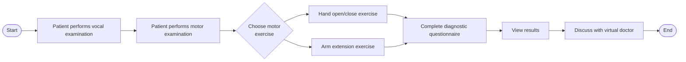
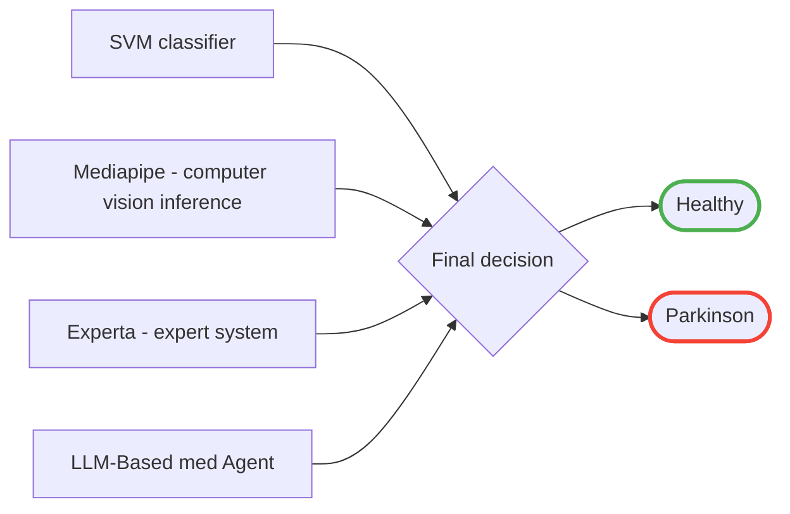

# Parkinson's Telemonitoring & Diagnostic Platform

## 📌 Overview
This repository contains the core classification and diagnostic modules designed for Parkinson's disease telemonitoring. 

## **Note:** 
This is an extraction from a fully developed e-health platform, originally built as a submission for the ***National University Olympiad in Artificial Intelligence & Programming 2026***. 

## 🏗️ Patient Workflow
The platform guides the patient through a comprehensive, multi-step remote examination process before delivering results.

## 🧠 Decision Engine Architecture

The final diagnostic decision is powered by a multi-modal AI approach, combining traditional machine learning, computer vision, expert systems, and LLM-based agents.

## 📊 Dataset (SVM Module)

The SVM classifier relies on the **Parkinson's Telemonitoring Dataset**, provided by the UCI Machine Learning Repository. It consists of biomedical voice measurements from individuals with early-stage Parkinson's disease.

* **Source:** [Parkinson's Telemonitoring - UCI Machine Learning Repository](https://archive.ics.uci.edu/dataset/189/parkinsons+telemonitoring)

## 🛠️ Tech Stack & Methodology

The modeling pipeline is contained within `parkinsons_model.ipynb` and includes data preprocessing, feature selection, and classification using the following stack:

* **Language:** Python 3
* **Data Processing:** `pandas`, `numpy`
* **Machine Learning:** `scikit-learn` (SVC, LinearSVC, PCA, SelectKBest, RFE)
* **Computer Vision:** `mediapipe`
* **Expert System:** `experta`
* **Visualization:** `matplotlib`, `seaborn`

